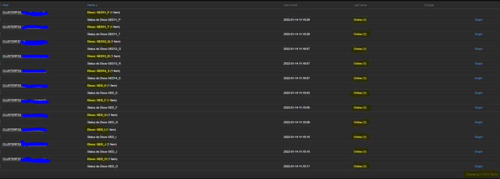

# Monitoramento de status de discos em Cluster da Microsoft

Abaixo segue procedimentos a serem realizados:
```
1 - Importar Template no Zabbix;
2 - Colocar o arquivo em PowerShell dentro da pasta do Zabbix Agent;
3 - Colocar o arquivo de .conf do Zabbix Agent no diretório correspondente (alterar caminho do arquivo Powershell salvo);
4 - Dar restart no serviço do Zabbix Agent.
```
# Dados recentes

